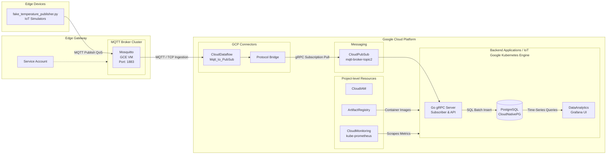

# Current Architecture

```mermaid
flowchart LR
    subgraph Edge["Edge Devices"]
        SIM[fake_temperature_publisher.py\nIoT Simulators]
    end

    subgraph EdgeGW["Edge Gateway"]
        subgraph MQTTCluster["MQTT Broker Cluster"]
            MOSQ[Mosquitto\nGCE VM\nPort: 1883]
        end
        SA[Service Account]
    end

    subgraph GCP["Google Cloud Platform"]
        subgraph ProjRes["Project-level Resources"]
            IAM[CloudIAM]
            AR[ArtifactRegistry]
            MON[CloudMonitoring\nkube-prometheus]
        end

        subgraph Connectors["GCP Connectors"]
            DF[CloudDataflow\nMqtt_to_PubSub]
            BRIDGE[Protocol Bridge]
        end

        subgraph Messaging["Messaging"]
            PS[CloudPubSub\nmqtt-broker-topic2]
        end

        subgraph GKE["Backend Applications / IoT\nGoogle Kubernetes Engine"]
            GRPC[Go gRPC Server\nSubscriber & API]
            PG[(PostgreSQL\nCloudNativePG)]
            GRAF[DataAnalytics\nGrafana UI]
        end
    end

    SIM -->|MQTT Publish QoS| MOSQ
    MOSQ -->|MQTT / TCP Ingestion| DF
    DF --> BRIDGE
    BRIDGE -->|gRPC Subscription Pull| PS
    PS --> GRPC
    GRPC -->|SQL Batch Insert| PG
    PG -->|Time-Series Queries| GRAF

    AR -->|Container Images| GKE
    MON -->|Scrapes Metrics| GKE
    SA -.-> MQTTCluster
```
