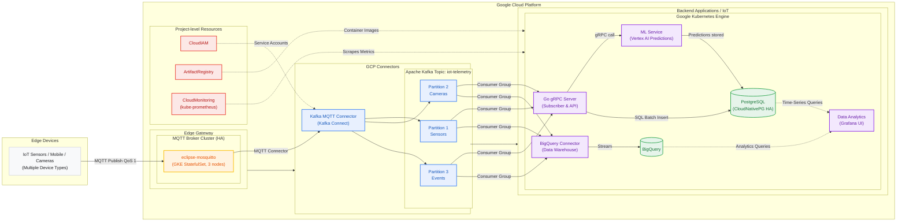

# Future Architecture (Kafka-based)

```mermaid
flowchart LR
    classDef edge fill:#f8f9fa,stroke:#dadce0,stroke-width:2px,color:#202124
    classDef gcp fill:#e8f0fe,stroke:#4285f4,stroke-width:2px,color:#185abc
    classDef mgmt fill:#fce8e6,stroke:#ea4335,stroke-width:2px,color:#b31412
    classDef db fill:#e6f4ea,stroke:#34a853,stroke-width:2px,color:#137333
    classDef broker fill:#fff3e0,stroke:#fbbc04,stroke-width:2px,color:#e65100
    classDef app fill:#f3e8fd,stroke:#9334e6,stroke-width:2px,color:#681da8

    subgraph Edge ["Edge Devices"]
        direction TB
        Sensor["IoT Sensors / Mobile / Cameras<br/>(Multiple Device Types)"]:::edge
    end

    subgraph Cloud ["Google Cloud Platform"]
        direction TB

        subgraph EdgeGateway ["Edge Gateway"]
            direction TB
            subgraph MQTTCluster ["MQTT Broker Cluster (HA)"]
                EMQX["eclipse-mosquitto<br/>(GKE StatefulSet, 3 nodes)"]:::broker
            end
        end

        subgraph Connectors ["GCP Connectors"]
            direction TB
            KafkaConn["Kafka MQTT Connector<br/>(Kafka Connect)"]:::gcp
            subgraph KafkaTopic ["Apache Kafka Topic: iot-telemetry"]
                P1["Partition 1<br/>Sensors"]:::gcp
                P2["Partition 2<br/>Cameras"]:::gcp
                P3["Partition 3<br/>Events"]:::gcp
            end
        end

        subgraph BackendApp ["Backend Applications / IoT"]
            direction TB
            subgraph GKE ["Google Kubernetes Engine"]
                GRPC["Go gRPC Server<br/>(Subscriber & API)"]:::app
                ML["ML Service<br/>(Vertex AI Predictions)"]:::app
                DW["BigQuery Connector<br/>(Data Warehouse)"]:::app
                CNPG[("PostgreSQL<br/>(CloudNativePG HA)")]:::db
                BQ[("BigQuery")]:::db
                Grafana["Data Analytics<br/>(Grafana UI)"]:::app
            end
        end

        subgraph Resources ["Project-level Resources"]
            direction LR
            IAM["CloudIAM"]:::mgmt
            Registry["ArtifactRegistry"]:::mgmt
            Prometheus["CloudMonitoring<br/>(kube-prometheus)"]:::mgmt
        end

        EdgeGateway --> Connectors
        Connectors --> BackendApp
    end

    Sensor -->|"MQTT Publish QoS 1"| EMQX
    EMQX -->|"MQTT Connector"| KafkaConn
    KafkaConn --> P1 & P2 & P3

    P1 & P2 & P3 -->|"Consumer Group"| GRPC
    P1 & P2 & P3 -->|"Consumer Group"| DW

    GRPC -->|"gRPC call"| ML
    GRPC -->|"SQL Batch Insert"| CNPG
    ML -->|"Predictions stored"| CNPG
    DW -->|"Stream"| BQ

    CNPG -.->|"Time-Series Queries"| Grafana
    BQ -.->|"Analytics Queries"| Grafana

    IAM -.->|"Service Accounts"| KafkaConn
    Registry -.->|"Container Images"| GKE
    Prometheus -.->|"Scrapes Metrics"| GKE
```
